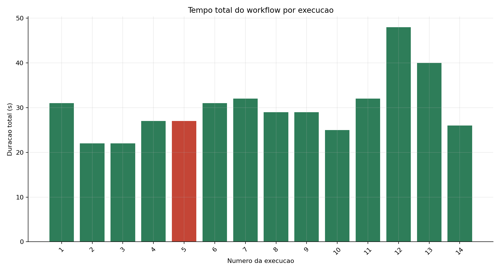
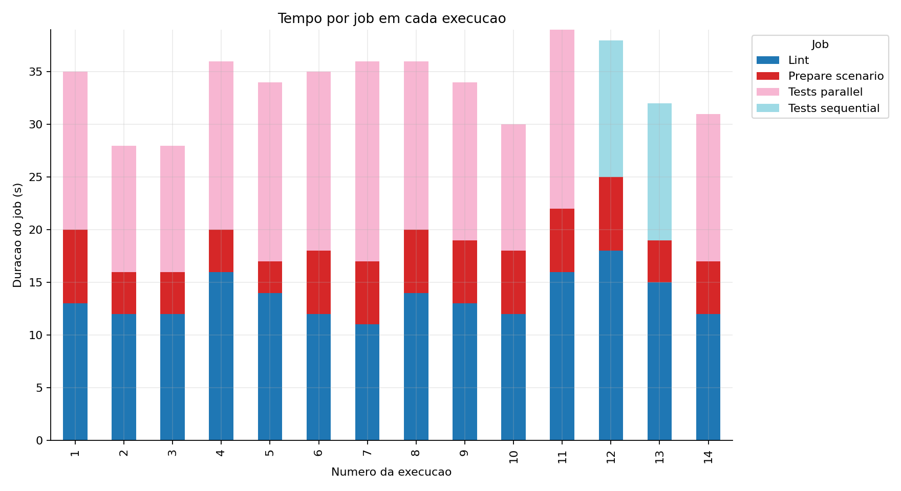
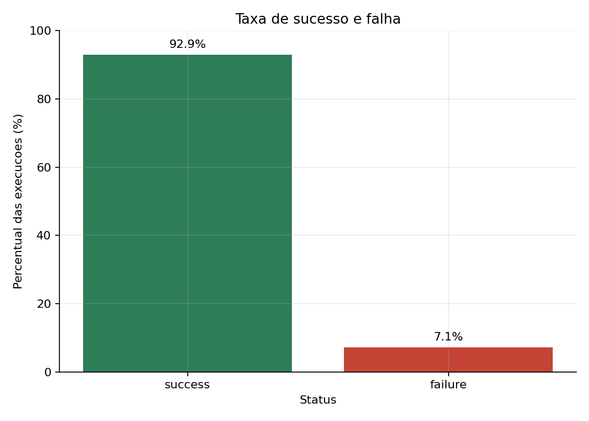
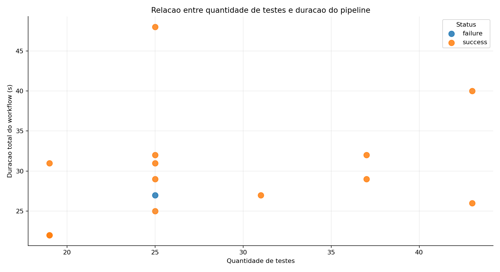
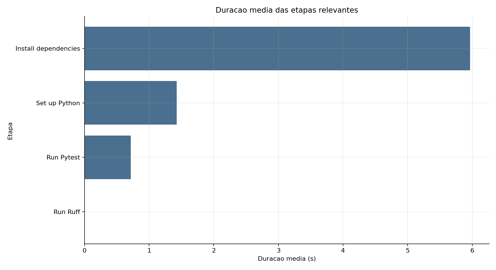

# Relatorio tecnico: metricas reais de pipeline CI/CD

Data da coleta: 2026-06-03.  
Repositorio: [Rafaelfurtadovs/ponderada_pipeline](https://github.com/Rafaelfurtadovs/ponderada_pipeline)  
Workflow YAML: [`.github/workflows/ci-metrics.yml`](https://github.com/Rafaelfurtadovs/ponderada_pipeline/blob/main/.github/workflows/ci-metrics.yml)  
Branch analisada: `main`  
Fonte dos dados: API do GitHub Actions + artefatos JUnit XML gerados pelo workflow.

## 1. Objetivo do experimento

O objetivo foi instrumentar um pipeline CI/CD real no GitHub Actions, executar
variacoes controladas e medir tempo, estabilidade e gargalos do processo. O
projeto escolhido foi uma biblioteca Python pequena (`pipeline_lab`) com funcoes
de qualidade de leituras numericas e uma suite Pytest parametrizada por
`experiment_scenario.json`.

O pipeline executa:

- preparacao do cenario;
- instalacao de dependencias;
- lint com Ruff;
- testes automatizados com Pytest;
- geracao de artefatos (`junit.xml`, `experiment-summary.json`, `ruff.txt`);
- coleta posterior das metricas com `scripts/collect_metrics.py`.

## 2. Como os dados foram coletados

O script [`scripts/collect_metrics.py`](../scripts/collect_metrics.py) consulta
a API REST do GitHub Actions, lista as execucoes do workflow, coleta jobs e
steps e baixa o artefato `test-results-<run_id>`. A partir do JUnit XML e do
`experiment-summary.json`, o script calcula quantidade de testes, falhas e tempo
medio dos testes.

Arquivos gerados:

- [`data/pipeline_runs.csv`](../data/pipeline_runs.csv): uma linha por run.
- [`data/pipeline_metrics.csv`](../data/pipeline_metrics.csv): uma linha por job,
  com campos no formato exigido pela atividade.
- [`data/step_metrics.csv`](../data/step_metrics.csv): uma linha por etapa.
- [`data/pipeline_runs.json`](../data/pipeline_runs.json): copia JSON da base de
  runs.

Comando usado:

```bash
python scripts/collect_metrics.py \
  --repo Rafaelfurtadovs/ponderada_pipeline \
  --workflow ci-metrics.yml \
  --branch main \
  --limit 20
```

## 3. Execucoes reais usadas como evidencia

Foram coletadas 14 execucoes reais do GitHub Actions. Uma delas falhou de forma
intencional para medir comportamento de pipeline vermelho.
O commit final dos entregaveis pode gerar uma execucao adicional no GitHub
Actions; essa execucao nao faz parte da amostra analisada abaixo.

| Run | Run ID | Commit | Status | Duracao (s) | Testes | Falhas | Cenario | Link |
|---:|---:|---|---|---:|---:|---:|---|---|
| 1 | 26888673945 | [`88e554f`](https://github.com/Rafaelfurtadovs/ponderada_pipeline/commit/88e554f) | success | 31 | 19 | 0 | baseline | [Actions](https://github.com/Rafaelfurtadovs/ponderada_pipeline/actions/runs/26888673945) |
| 2 | 26888748493 | [`f6d337a`](https://github.com/Rafaelfurtadovs/ponderada_pipeline/commit/f6d337a) | success | 22 | 19 | 0 | baseline | [Actions](https://github.com/Rafaelfurtadovs/ponderada_pipeline/actions/runs/26888748493) |
| 3 | 26888814122 | [`8b6fa47`](https://github.com/Rafaelfurtadovs/ponderada_pipeline/commit/8b6fa47) | success | 22 | 19 | 0 | r03_cache_warm | [Actions](https://github.com/Rafaelfurtadovs/ponderada_pipeline/actions/runs/26888814122) |
| 4 | 26888814620 | [`3bf755c`](https://github.com/Rafaelfurtadovs/ponderada_pipeline/commit/3bf755c) | success | 27 | 31 | 0 | r04_more_tests | [Actions](https://github.com/Rafaelfurtadovs/ponderada_pipeline/actions/runs/26888814620) |
| 5 | 26888817920 | [`455c157`](https://github.com/Rafaelfurtadovs/ponderada_pipeline/commit/455c157) | failure | 27 | 25 | 1 | r06_failure | [Actions](https://github.com/Rafaelfurtadovs/ponderada_pipeline/actions/runs/26888817920) |
| 6 | 26888818644 | [`12be66c`](https://github.com/Rafaelfurtadovs/ponderada_pipeline/commit/12be66c) | success | 31 | 25 | 0 | r05_slow_tests | [Actions](https://github.com/Rafaelfurtadovs/ponderada_pipeline/actions/runs/26888818644) |
| 7 | 26888820058 | [`7c332cc`](https://github.com/Rafaelfurtadovs/ponderada_pipeline/commit/7c332cc) | success | 32 | 25 | 0 | r07_recovery | [Actions](https://github.com/Rafaelfurtadovs/ponderada_pipeline/actions/runs/26888820058) |
| 8 | 26888822293 | [`addb7e4`](https://github.com/Rafaelfurtadovs/ponderada_pipeline/commit/addb7e4) | success | 29 | 25 | 0 | r08_no_cache | [Actions](https://github.com/Rafaelfurtadovs/ponderada_pipeline/actions/runs/26888822293) |
| 9 | 26888822884 | [`ae72107`](https://github.com/Rafaelfurtadovs/ponderada_pipeline/commit/ae72107) | success | 29 | 37 | 0 | r09_no_cache_more_tests | [Actions](https://github.com/Rafaelfurtadovs/ponderada_pipeline/actions/runs/26888822884) |
| 10 | 26888824460 | [`0ab1169`](https://github.com/Rafaelfurtadovs/ponderada_pipeline/commit/0ab1169) | success | 25 | 25 | 0 | r12_parallel_pair | [Actions](https://github.com/Rafaelfurtadovs/ponderada_pipeline/actions/runs/26888824460) |
| 11 | 26888824793 | [`efa216b`](https://github.com/Rafaelfurtadovs/ponderada_pipeline/commit/efa216b) | success | 32 | 37 | 0 | r10_cache_restored | [Actions](https://github.com/Rafaelfurtadovs/ponderada_pipeline/actions/runs/26888824793) |
| 12 | 26888826817 | [`beeb71b`](https://github.com/Rafaelfurtadovs/ponderada_pipeline/commit/beeb71b) | success | 48 | 25 | 0 | r11_sequential | [Actions](https://github.com/Rafaelfurtadovs/ponderada_pipeline/actions/runs/26888826817) |
| 13 | 26888827636 | [`3b6ef93`](https://github.com/Rafaelfurtadovs/ponderada_pipeline/commit/3b6ef93) | success | 40 | 43 | 0 | r13_sequential_slow_wide | [Actions](https://github.com/Rafaelfurtadovs/ponderada_pipeline/actions/runs/26888827636) |
| 14 | 26888830926 | [`da5fdbf`](https://github.com/Rafaelfurtadovs/ponderada_pipeline/commit/da5fdbf) | success | 26 | 43 | 0 | r14_parallel_slow_wide | [Actions](https://github.com/Rafaelfurtadovs/ponderada_pipeline/actions/runs/26888830926) |

## 4. Variacoes feitas

As variacoes foram aplicadas por commits reais alterando
`experiment_scenario.json` ou o workflow.

| Cenario | Variacao controlada |
|---|---|
| baseline | pipeline inicial verde, cache habilitado, jobs paralelos |
| update actions | atualizacao de `checkout`, `setup-python` e `upload-artifact` para majors atuais |
| r03_cache_warm | repeticao verde para observar cache aquecido |
| r04_more_tests | aumento de 19 para 31 testes totais |
| r05_slow_tests | atraso de 0,03 s em cada teste gerado |
| r06_failure | falha proposital em um teste gerado |
| r07_recovery | recuperacao do pipeline apos falha |
| r08_no_cache | cache de dependencias desabilitado |
| r09_no_cache_more_tests | cache desabilitado com mais testes |
| r10_cache_restored | cache reabilitado com a mesma quantidade de testes do run anterior |
| r11_sequential | lint e testes em ordem sequencial |
| r12_parallel_pair | cenario equivalente ao sequencial, mas paralelo |
| r13_sequential_slow_wide | modo sequencial com mais testes e atraso |
| r14_parallel_slow_wide | cenario equivalente ao anterior, mas paralelo |

## 5. Graficos

### Tempo total do pipeline por execucao



### Tempo por job



### Taxa de sucesso e falha



### Quantidade de testes vs duracao



### Duracao media das etapas relevantes



## 6. Analise dos resultados

Resumo estatistico dos 14 runs:

- tempo medio do workflow: 30,07 s;
- mediana: 29 s;
- minimo: 22 s;
- maximo: 48 s;
- taxa de sucesso: 92,9%;
- taxa de falha: 7,1%.

### Qual etapa mais contribuiu para o tempo total?

A maior etapa medida foi `Install dependencies`, com media de 5,96 s e maximo
de 8 s. `Set up Python` teve media de 1,43 s. `Run Pytest` teve media de apenas
0,71 s, mesmo nos cenarios com mais testes. Portanto, para este projeto, o
gargalo nao foi a execucao da suite em si, mas o custo fixo de preparar ambiente
e instalar dependencias em cada job.

No nivel de job, `Tests parallel` teve media de 15,17 s, `Lint` teve media de
13,57 s e `Prepare scenario` teve media de 5,29 s. Isso mostra que existe um
custo fixo relevante por job em runners hospedados.

### Houve diferenca significativa entre execucoes com e sem cache?

Nao houve ganho claro com cache neste experimento. Os dois runs sem cache
tiveram media de 29 s. Os runs com cache tiveram media de 30,25 s, mas esse
grupo inclui cenarios sequenciais e o primeiro run frio, entao a comparacao nao
e perfeitamente isolada.

Na comparacao mais proxima:

- `r09_no_cache_more_tests`: 37 testes, cache desabilitado, 29 s;
- `r10_cache_restored`: 37 testes, cache habilitado, 32 s.

O resultado observado contraria a hipotese inicial de que cache reduziria o
tempo. A interpretacao mais provavel e que o projeto tem poucas dependencias e
o custo de provisionamento, instalacao editavel e variacao do runner domina o
tempo total.

### O paralelismo reduziu o tempo total?

Sim. A reducao foi clara nos pares equivalentes:

- 25 testes: sequencial 48 s (`r11_sequential`) contra paralelo 25 s
  (`r12_parallel_pair`), reducao de 23 s;
- 43 testes com atraso: sequencial 40 s (`r13_sequential_slow_wide`) contra
  paralelo 26 s (`r14_parallel_slow_wide`), reducao de 14 s.

O paralelismo ajudou porque `Lint` e `Tests parallel` rodam ao mesmo tempo apos
`Prepare scenario`. No modo sequencial, o job de testes espera o lint terminar,
somando tempos que antes ficavam sobrepostos.

### Quais falhas foram mais frequentes?

Houve apenas uma falha em 14 execucoes, e ela foi proposital: o run
`26888817920` (`r06_failure`) falhou em um teste Pytest gerado. A falha foi do
tipo teste automatizado, com 1 falha em 25 testes. Nao houve falha de lint,
instalacao ou upload de artefatos.

### O pipeline fornece feedback rapido o suficiente?

Para um projeto pequeno, sim. A mediana de 29 s e aceitavel para feedback de
desenvolvimento. Mesmo o pior caso medido, 48 s, ainda fica abaixo de 1 minuto.
O ponto de atencao e que o custo fixo domina: se o projeto crescer, a instalacao
duplicada em jobs separados pode se tornar um gargalo real.

### Melhorias possiveis

- Consolidar etapas quando o projeto for pequeno, evitando instalar dependencias
  duas vezes em jobs separados.
- Manter paralelismo entre lint e testes quando a suite crescer.
- Fixar e revisar periodicamente as versoes das actions oficiais.
- Separar testes rapidos e lentos caso a suite passe de poucos segundos.
- Coletar tambem cache hit/miss explicitamente, tamanho dos artefatos e lead
  time entre commit e conclusao.

### Limitacoes dos dados

- A amostra tem apenas 14 execucoes, suficiente para a atividade, mas pequena
  para inferencia estatistica forte.
- O GitHub Actions usa runners hospedados, entao ha ruido de fila,
  provisionamento e variacao de maquina.
- Os tempos das etapas pela API aparecem em resolucao de segundos; etapas muito
  rapidas, como Ruff, podem aparecer como 0 s.
- O cache foi avaliado em um projeto pequeno; em projetos com dependencias
  maiores o resultado pode ser diferente.
- Os commits foram enviados em sequencia rapida, permitindo execucoes
  concorrentes; isso ajuda a gerar dados, mas adiciona ruido de agendamento.

## 7. Resultados inesperados

Resultado inesperado 1: cache nao reduziu o tempo. A hipotese inicial era que
habilitar cache de `pip` deixaria as execucoes mais rapidas. O resultado foi o
oposto no par mais direto: 29 s sem cache contra 32 s com cache restaurado. A
explicacao provavel e que o conjunto de dependencias e pequeno e o overhead do
runner pesa mais que a restauracao do cache.

Resultado inesperado 2: o cenario sequencial com mais testes e atraso
(`r13_sequential_slow_wide`, 40 s) foi mais rapido que o sequencial menor
(`r11_sequential`, 48 s). A hipotese inicial era que mais testes sempre
aumentariam o tempo total. O dado mostrou que, neste pipeline curto, ruido de
provisionamento, cache e agendamento pode superar o custo adicional dos testes.

## 8. Hipotese inicial vs resultado observado

Hipoteses iniciais:

- cache reduziria o tempo de instalacao;
- paralelismo reduziria o tempo total;
- aumento de testes aumentaria proporcionalmente o tempo total;
- falhas de teste seriam refletidas no status final sem impedir upload de
  artefatos.

Resultados observados:

- cache nao trouxe ganho mensuravel;
- paralelismo reduziu o tempo total de forma forte;
- quantidade de testes teve impacto menor que o custo fixo do runner;
- o run com teste falhando preservou artefatos e apareceu corretamente como
  `failure`.

## 9. Como esta analise apoia decisoes de engenharia

Esta analise mostra onde otimizar primeiro. Para este projeto, gastar esforco
reduzindo tempo dos testes nao seria prioridade, porque `Run Pytest` representa
menos de 1 s em media. A decisao mais racional seria manter jobs paralelos,
reduzir instalacoes duplicadas quando possivel e melhorar a instrumentacao de
cache. Em um projeto maior, o mesmo processo permitiria decidir quando dividir
suites, quando investir em cache, quando paralelizar e quando bloquear merges
por estabilidade.

## 10. Reproducao

Instalacao local:

```bash
python -m pip install -e ".[dev,analysis]"
```

Validacao local:

```bash
ruff check .
pytest --junitxml=reports/junit.xml
```

Aplicacao de um cenario:

```bash
python scripts/set_scenario.py \
  --scenario-id exemplo \
  --mode parallel \
  --cache enabled \
  --tests 24 \
  --delay 0 \
  --fail none \
  --notes "cenario verde com mais testes"
git add experiment_scenario.json
git commit -m "Experiment example scenario"
git push origin main
```

Coleta e graficos:

```bash
python scripts/collect_metrics.py --repo Rafaelfurtadovs/ponderada_pipeline --workflow ci-metrics.yml --branch main --limit 20
python scripts/generate_charts.py --data-dir data --output-dir reports/figures
```
